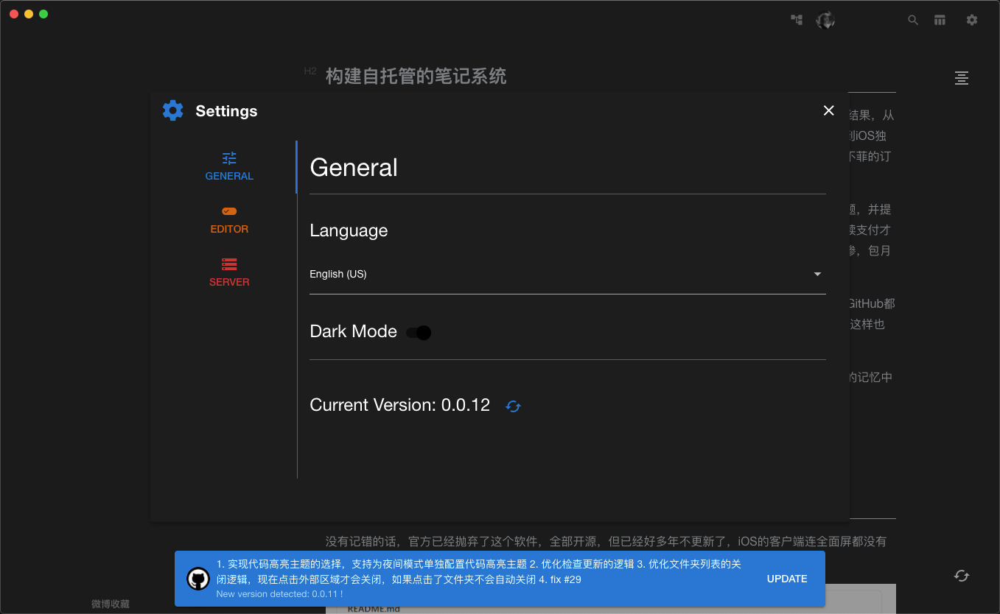

<h2 align="center">Neeto Vue</h2>

<p align="center">An Awesome Wiz Note Client</p>

<h3 align="center">English | <a href="./README-zh_cn.md" target="_self">简体中文</a></h3>

### Content

- [Status](#status)

- [Installation](#installation)

- [Wiz Community](#wiz-community)

- [ScreenShot](#screenshot)

- [Installation](#installation)

- [Feature](#feature)

- [Attention](#attention)

- [Change Log](#change-log)

### Status

     
[](https://app.fossa.com/projects/git%2Bgithub.com%2FTankNee%2FNeeto-Vue?ref=badge_shield)

### Introduction

[In order to write notes, I develop a note application](https://www.tanknee.cn/2020/10/02/%E6%88%91%E4%B8%BA%E4%BA%86%E8%AE%B0%E7%AC%94%E8%AE%B0%E6%89%8B%E5%86%99%E4%BA%86%E4%B8%80%E4%B8%AA%E5%AE%A2%E6%88%B7%E7%AB%AF/)

### Wiz Community

Follow Wiz Community in WeChat：


If you intend to prompt the development of Wiz Community，join us pls！

### ScreenShot


### Installation

[Releases](https://github.com/TankNee/Neeto-Vue/releases/latest)

You are also be able to check update in Neeto-Vue Settings Dialog



#### Arch Linux

Install and upgrade from [AUR](https://aur.archlinux.org/packages/neeto-vue-bin/)

Thanks to [yjun123](https://github.com/yjun123)'s contribution.

```bash
# AUR helper
# yay
yay -S neeto-vue-bin

# pikaur
pikaur -S neeto-vue-bin
```

### Feature

- More Beautiful

- More Powerful

- Lighter Size

- Better Dark Mode In Desktop Platform

- Export single note or whole note folder to certain path

- Loading Animation

- New version check

- International, support English and Chinese(Simplified)

- Keymap: [vditor keymap](https://ld246.com/guide/markdown)

- Support to send note to flomo app

- Support note lock

### Attention

- There's another problem with copying notes, Since I haven't handled the transfer of note resources, I don't recommend copying notes for the time being
- Image upload service only supports drag and drop upload or fill in picture link directly
- When using the wiz official image service, only the temporary address of the image will be displayed
- For the time being, only the third-party Web upload service is available. (Settings > > editor > > image upload service) please refer to：[picgo-plugin-web-uploader](https://github.com/yuki-xin/picgo-plugin-web-uploader)
  - `url`: Picture upload api url
  - `paramName`: POST parameter name(eg:`image`)
  - `jsonPath`: Jsonpath of the return value of the image URL`(eg:data.url)`
  - `customHeader`: custom request http headers,using standard JSON schema(eg: `{"key":"value"}`)
  - `customBody`: custom request body, using standard JSON schema(eg: `{"key":"value"}`)

### Change Log

<details>
<summary>Version change log</summary>

## 2021 01 17 Update 1.0.2

1. Remove the underline of links
2. Extract source plain text from note content instead of using the origin markdown text

## 2020 12 22 Update 1.0.0

1. Realize the label system
2. Right click to upload pictures, which depends on picgo
3. Optimize a lot of details

## 2020 12 22 Update 0.0.23

1. To achieve a simpler image upload method: right click in the editor and select the image to upload.
2. Temporarily abandon the drag upload mode.

## 2020 12 19 Update 0.0.22

1. Add Chinese readme file
2. Improve the readme description
3. Add note locking function to make it easier to check notes.

## 2020 12 17 Update 0.0.21

1. Add flomo API support. Set > > Service > > flomo. Then use the right-click menu in the list to send notes to flomo
2. Upgrade note editor to v3.7.1
3. Cache key naming policy adjustment

## 2020 12 03 Update 0.0.20

1. Fixed the problem that the server could not display the folder when it returned the out of order folder list

## 2020 11 30 Update 0.0.19

1. Repair the export failure when there are illegal characters in the note name

## 2020 11 27 Update 0.0.18

1. Export a single file to markdown
2. Export the entire folder to the specified directory in the format of markdown

## 2020 09 27 Update 0.0.6

1. Better login experience
2. Optimize the interface without content
3. Optimize code logic

## 2020 09 26 Update 0.0.5

1. Add GitHub to build automatically

## 2020 09 25 Update 0.0.4

1. Optimize the header display in MacOS
2. Add vditor shortcut key, [shortcut key to check address]（ https://ld246.com/guide/markdown )
3. Optimization Icon
4. Add the Save button in the lower right corner of vdtor, but the outline button in the upper right corner has not been implemented
5. Learn from wizlite to open the links in notes
6. Optimize invalid code

## 2020 09 22 Update 0.0.3

1. Version updated to 0.0.3
2. Add drag and drop image upload
3. Drag the picture directly into the editor
4. Remember to click the location of the image to be inserted first, otherwise it will be inserted directly into the place where I last clicked. I have no way to fix it for the time being
5. Fix the size of editor area
6. Add notes to modify the date display
7. Fix the problem of missing translation

</details>

### License

[](https://app.fossa.com/projects/git%2Bgithub.com%2FTankNee%2FNeeto-Vue?ref=badge_large)
