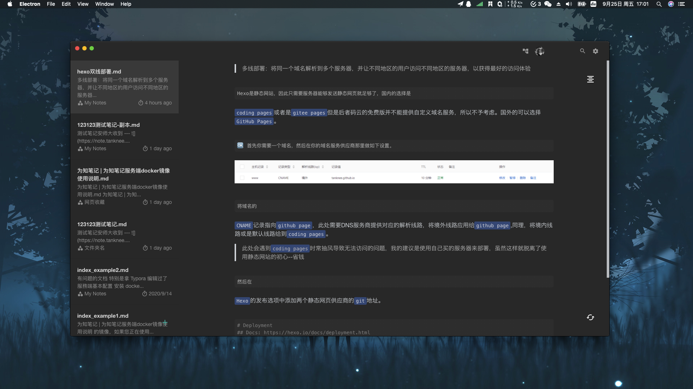
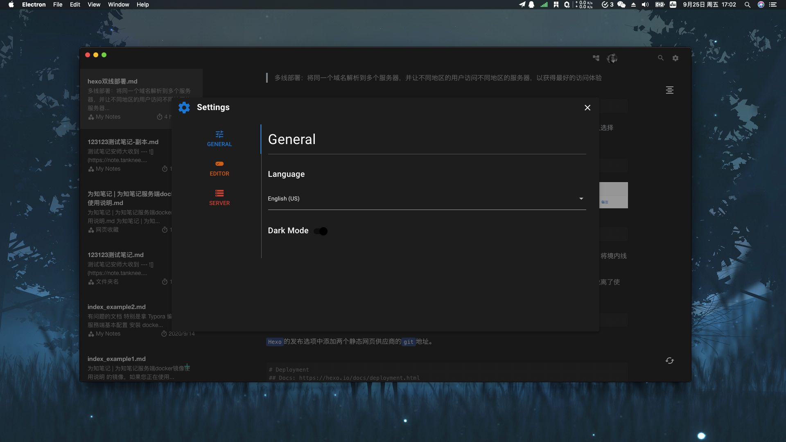
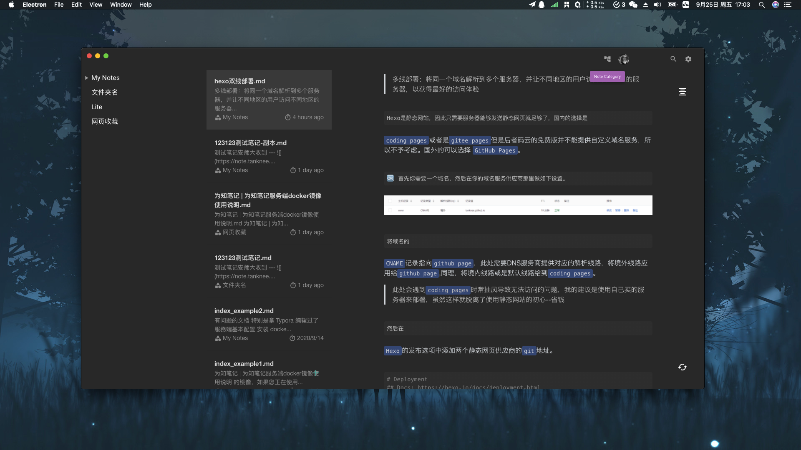

## Neeto Vue
An Awesome Wiz Note Client

### Status

### Introduction

[为了记笔记，我专门写了一个笔记客户端](https://www.tanknee.cn/2020/10/02/%E6%88%91%E4%B8%BA%E4%BA%86%E8%AE%B0%E7%AC%94%E8%AE%B0%E6%89%8B%E5%86%99%E4%BA%86%E4%B8%80%E4%B8%AA%E5%AE%A2%E6%88%B7%E7%AB%AF/)

### ScreenShot

### Download

[Releases](https://github.com/TankNee/Neeto-Vue/releases/latest)

You are also be able to check update in Neeto-Vue Settings Dialog

### Feature

- More Beautiful

- More Powerful

- Lighter Size

- Better Dark Mode In Desktop Platform

### Attention

- There's another problem with copying notes, Since I haven't handled the transfer of note resources, I don't recommend copying notes for the time being